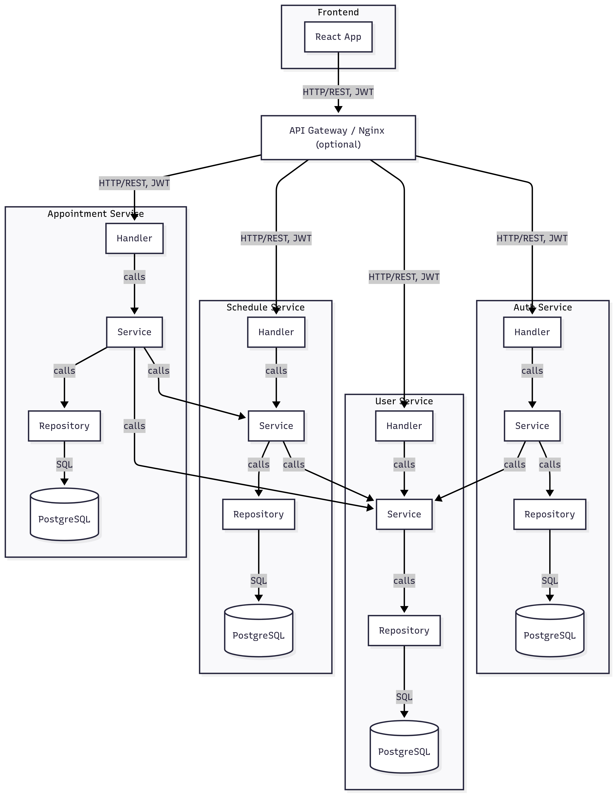
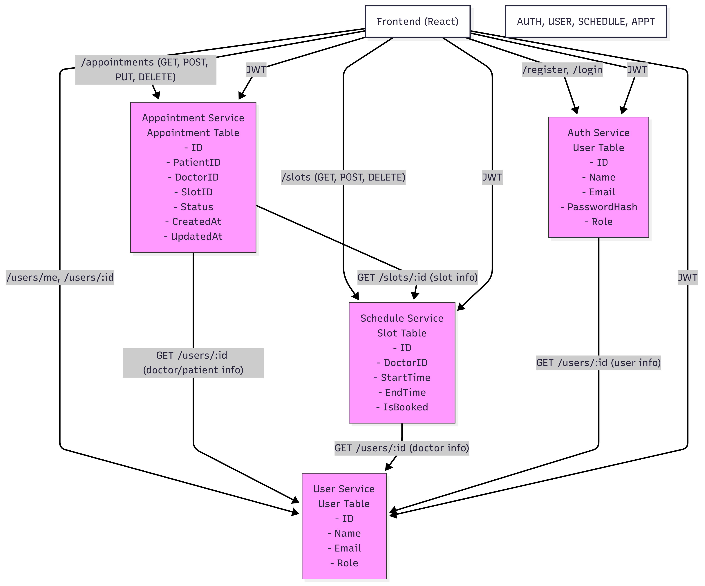
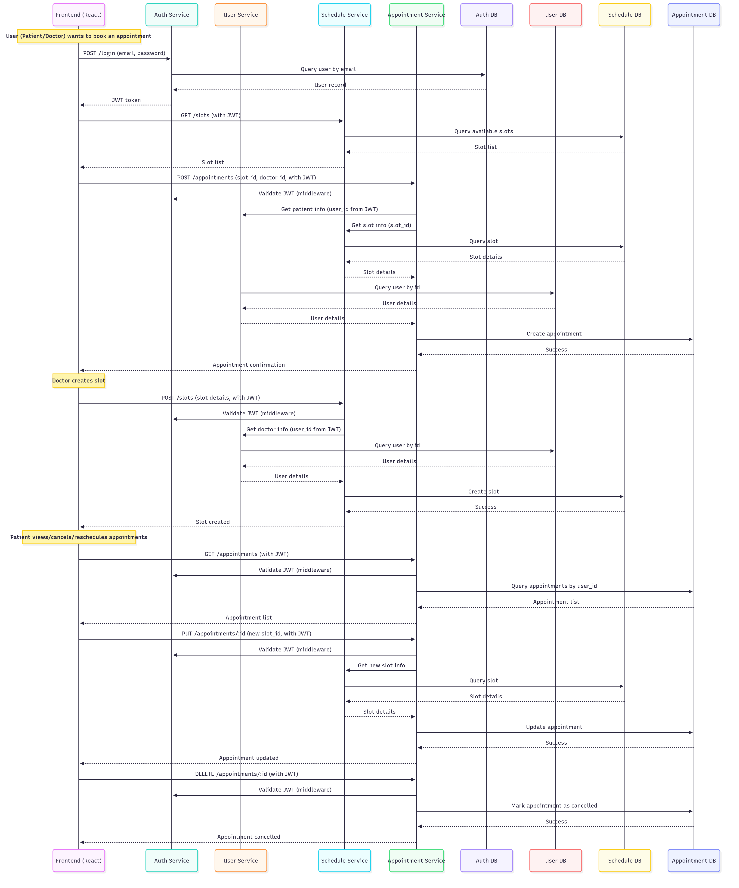

# Doctor Appointment Booking System

A microservices-based system for booking doctor appointments, built with Go (Gin, GORM), React, and Docker.

## Features

- User authentication (JWT)
- Doctor slot management (doctors can create, view, and manage all their slots)
- Patient appointment booking (patients can only book available slots)
- Role-based access (doctor/patient)
- Appointment management (view, reschedule, cancel)
- RESTful APIs with interactive Swagger docs

## Tech Stack

- Go (Gin, GORM)
- React
- Docker & Docker Compose
- PostgreSQL (or your DB)
- Swagger/OpenAPI

## Project Structure & Modularity

Each backend service follows a clear, modular structure:

```
<service>/
  cmd/main.go         # Entry point
  pkg/
    handler/          # HTTP handlers (controllers)
    service/          # Business logic
    repository/       # Data access (DB)
    model/            # Data models (structs)
    middleware/       # Middleware (JWT, CORS, etc.)
    util/             # Utilities (JWT helpers, etc.)
```

Frontend is organized by React components and a single API layer (`src/api.js`).

## Setup

### Prerequisites

- Docker & Docker Compose
- Node.js (for local frontend dev)
- Go (for local backend dev)

### Local Development

#### Backend Services

Each service (`auth`, `user`, `schedule`, `appointment`) can be run individually:

```bash
cd <service>
go run cmd/main.go
```

#### Frontend

```bash
cd frontend
npm install
npm start
```

#### All Services with Docker Compose

```bash
docker-compose up --build
```

- Frontend: [http://localhost:3000](http://localhost:3000)
- Auth: [http://localhost:8080](http://localhost:8080)
- User: [http://localhost:8081](http://localhost:8081)
- Schedule: [http://localhost:8082](http://localhost:8082)
- Appointment: [http://localhost:8083](http://localhost:8083)

### API Documentation (Swagger/OpenAPI)

Each service exposes interactive Swagger docs at `/swagger/index.html`:

- **Auth Service:** [http://localhost:8080/swagger/index.html](http://localhost:8080/swagger/index.html)
- **User Service:** [http://localhost:8081/swagger/index.html](http://localhost:8081/swagger/index.html)
- **Schedule Service:** [http://localhost:8082/swagger/index.html](http://localhost:8082/swagger/index.html)
- **Appointment Service:** [http://localhost:8083/swagger/index.html](http://localhost:8083/swagger/index.html)

## Best Practices

- **Clear separation of concerns:** Handlers, services, repositories, and models are kept separate.
- **Named request/response structs:** For clarity and Swagger compatibility.
- **Role-based access:** Enforced in both backend and frontend.
- **Frontend filtering:** Patients see only available slots; doctors see all their slots.
- **Swagger/OpenAPI:** All endpoints are documented and browsable.

## Architecture Diagrams

### High-Level Design (HLD)
The HLD diagram below shows the overall architecture of the Doctor Appointment Booking System. It illustrates how the frontend interacts with each backend microservice, how services communicate with their respective databases, and the main service-to-service interactions. This view is useful for understanding the big picture and the boundaries between components.



### Low-Level Design (LLD)
The LLD diagram provides a more detailed view, including the main database tables and their fields for each service, as well as the specific API endpoints and service-to-service calls. This helps developers understand the data model and the exact flow of information between services.



### Booking Flow Sequence Diagram
This sequence diagram shows a typical flow for booking an appointment, including authentication, slot lookup, and cross-service data fetching.




